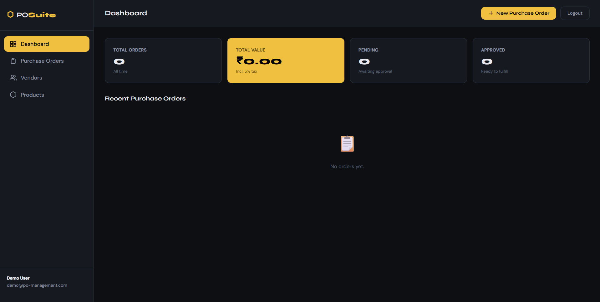
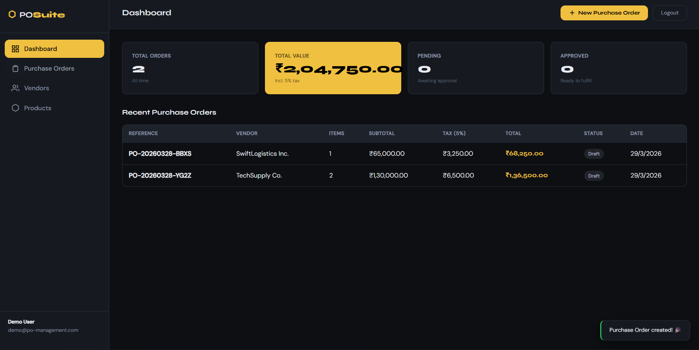
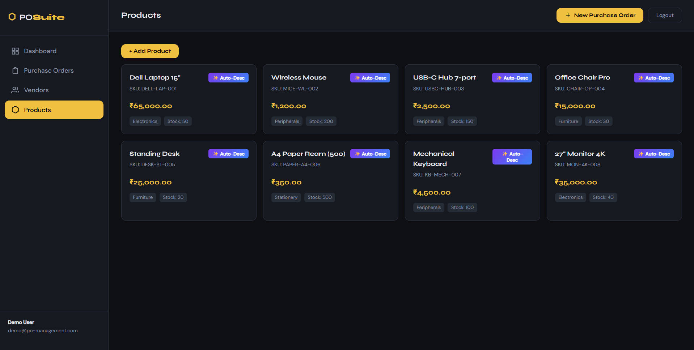

# ⬡ POSuite — Purchase Order Management System

A full-stack Purchase Order Management System built for the IV Innovations Private Limited assignment.
Features a FastAPI backend, PostgreSQL database, vanilla JS frontend, JWT + Google OAuth authentication, and optional Gemini AI integration.

---

## 🏗️ Architecture Overview

```
po-management/
├── backend/                  # Python FastAPI service
│   ├── app/
│   │   ├── main.py           # App entry point + CORS
│   │   ├── database.py       # SQLAlchemy engine & session
│   │   ├── models.py         # ORM models (Vendor, Product, PurchaseOrder, POItem)
│   │   ├── schemas.py        # Pydantic request/response schemas
│   │   └── routers/
│   │       ├── auth.py       # JWT + Google OAuth endpoints
│   │       ├── vendors.py    # Vendor CRUD
│   │       ├── products.py   # Product CRUD + AI description
│   │       └── purchase_orders.py  # PO CRUD + tax calculation
│   ├── migrations/
│   │   └── schema.sql        # PostgreSQL schema + seed data
│   ├── requirements.txt
│   ├── Dockerfile
│   └── .env.example
├── frontend/
│   ├── templates/index.html  # Single-page application
│   └── static/
│       ├── css/style.css     # Full custom dark-theme CSS
│       └── js/app.js         # All frontend logic (vanilla JS)
├── docker-compose.yml
├── nginx.conf
└── README.md
```

---

## 🗄️ Database Design

### Schema Rationale

Four tables with proper FK relationships:

```
vendors (1) ──────────< purchase_orders (1) ──────────< purchase_order_items
                                                                    │
products (1) ───────────────────────────────────────────────────────┘
```

| Table | Primary Key | Foreign Keys | Purpose |
|---|---|---|---|
| `vendors` | `id` | — | Supplier master data |
| `products` | `id` | — | Product catalog with pricing |
| `purchase_orders` | `id` | `vendor_id → vendors.id` | Order header with totals |
| `purchase_order_items` | `id` | `purchase_order_id → purchase_orders.id`, `product_id → products.id` | Line items (ON DELETE CASCADE) |

**Design decisions:**
- `unit_price` is **denormalized** into `purchase_order_items` — this preserves the price at order time even if the product price changes later (standard ERP pattern).
- `ON DELETE CASCADE` on `purchase_order_items` ensures referential integrity when a PO is deleted.
- Indexes on `vendor_id`, `status`, and FK columns for query performance.
- `POStatus` as a PostgreSQL ENUM ensures only valid statuses can be stored.

---

## ⚙️ Business Logic: Calculate Total

Located in `backend/app/routers/purchase_orders.py` → `_calculate_totals()`:

```python
TAX_RATE = 0.05  # 5%

def _calculate_totals(items_data, db):
    subtotal = sum(product.unit_price * item.quantity for each item)
    tax_amount  = round(subtotal * TAX_RATE, 2)    # 5% tax
    total_amount = round(subtotal + tax_amount, 2)
    return subtotal, tax_amount, total_amount, enriched_items
```

- Fetches **live unit_price** from the `products` table
- Snapshots the price into `purchase_order_items.unit_price` at creation time
- All monetary values rounded to 2 decimal places
- The frontend also **mirrors this calculation** in real-time as rows are added

---

## 🚀 Running Locally (Two Methods)

### Method 1: Docker Compose (Recommended)

```bash
# 1. Clone the repository
git clone <your-repo-url>
cd po-management

# 2. Copy and fill in environment variables
cp backend/.env.example backend/.env
# Edit backend/.env with your actual values

# 3. Start everything
docker-compose up --build

# Services:
#   Frontend → http://localhost:3000
#   Backend  → http://localhost:8000
#   API Docs → http://localhost:8000/docs
```

### Method 2: Manual Setup

**Prerequisites:** Python 3.11+, PostgreSQL 14+

```bash
# ── Database ─────────────────────────────────────────────
createdb po_management
psql -U postgres -d po_management -f backend/migrations/schema.sql

# ── Backend ──────────────────────────────────────────────
cd backend
python -m venv venv
source venv/bin/activate      # Windows: venv\Scripts\activate
pip install -r requirements.txt
cp .env.example .env          # Fill in your values

uvicorn app.main:app --reload --port 8000

# ── Frontend ─────────────────────────────────────────────
# Open frontend/templates/index.html in your browser
# (or serve with any static server)
cd frontend
python -m http.server 3000 --directory .
# then visit http://localhost:3000/templates/index.html
```

---

## 🔐 Authentication

Two modes are supported:

### 1. Demo Login (No setup needed)
Click **"⚡ Demo Login"** — the backend issues a JWT for a demo user. Perfect for testing.

### 2. Google OAuth (Production)
1. Create a project at [console.cloud.google.com](https://console.cloud.google.com)
2. Enable the Google+ API
3. Create OAuth 2.0 credentials
4. Add `http://localhost:8000/api/auth/callback/google` as an authorized redirect URI
5. Set `GOOGLE_CLIENT_ID` and `GOOGLE_CLIENT_SECRET` in `.env`

The frontend will then use the `/api/auth/google/url` endpoint for the redirect flow.

---

## ✨ AI Description Feature (Gen AI)

Each product card has an **"✨ Auto-Desc"** button that calls the Gemini API to generate a 2-sentence professional marketing description.

### Setup
1. Get a free API key from [aistudio.google.com](https://aistudio.google.com)
2. Set `GEMINI_API_KEY=your-key` in `.env`

### Fallback
If no API key is configured, the system uses a **rule-based fallback** that generates a professional template description — so the feature always works even without a key.

---

## 📡 API Endpoints

| Method | Endpoint | Auth | Description |
|---|---|---|---|
| POST | `/api/auth/demo-login` | No | Get demo JWT |
| GET | `/api/auth/google/url` | No | Get Google OAuth URL |
| GET | `/api/auth/me` | Yes | Get current user |
| GET | `/api/vendors/` | No | List all vendors |
| POST | `/api/vendors/` | Yes | Create vendor |
| PUT | `/api/vendors/{id}` | Yes | Update vendor |
| DELETE | `/api/vendors/{id}` | Yes | Delete vendor |
| GET | `/api/products/` | No | List all products |
| POST | `/api/products/` | Yes | Create product |
| POST | `/api/products/{id}/generate-description` | Yes | AI description |
| GET | `/api/purchase-orders/` | No | List POs (filterable by status) |
| POST | `/api/purchase-orders/` | Yes | Create PO (auto-calculates totals) |
| GET | `/api/purchase-orders/{id}` | No | Get single PO |
| PATCH | `/api/purchase-orders/{id}/status` | Yes | Update PO status |
| DELETE | `/api/purchase-orders/{id}` | Yes | Delete draft/rejected PO |

Full interactive docs available at **http://localhost:8000/docs** (Swagger UI).

---

## 🎨 Frontend Features

- **Dashboard** with live stats (total orders, value, pending, approved)




- **Purchase Orders** table with inline status updates




- **Vendors** grid with star ratings


- **Products** grid with AI description button




- **Create PO Modal** with dynamic "Add Row" — add unlimited product lines, live total calculation including 5% tax
- **JWT auth** — token stored in `localStorage`, sent as `Authorization: Bearer` header
- Dark luxury theme with Syne + DM Sans typography

---

## 🏆 Bonus Points Implemented

| Bonus | Status | Notes |
|---|---|---|
| Java/Spring Boot | ❌ | Out of scope for this submission |
| NoSQL (MongoDB) | ❌ | Not implemented |
| Node.js real-time notifications | ❌ | Not implemented |
| AI integration | ✅ | Gemini API with rule-based fallback |
| Google OAuth | ✅ | Full OAuth2 + JWT flow |
| Docker | ✅ | Full docker-compose setup |
| Interactive API docs | ✅ | Swagger UI at `/docs` |

---

## 🧪 Testing the Create PO Flow

1. Open http://localhost:3000 → click **Demo Login**
2. Navigate to **Vendors** → add a vendor (pre-seeded vendors also available)
3. Navigate to **Products** → add a product (pre-seeded products also available)
4. Click **"New Purchase Order"** (top-right)
5. Select a vendor, click **"+ Add Row"** to add products
6. Watch the live subtotal/tax/total calculation
7. Click **"Create PO"** → see it appear on the Dashboard
8. Navigate to **Purchase Orders** → change the status via the dropdown
